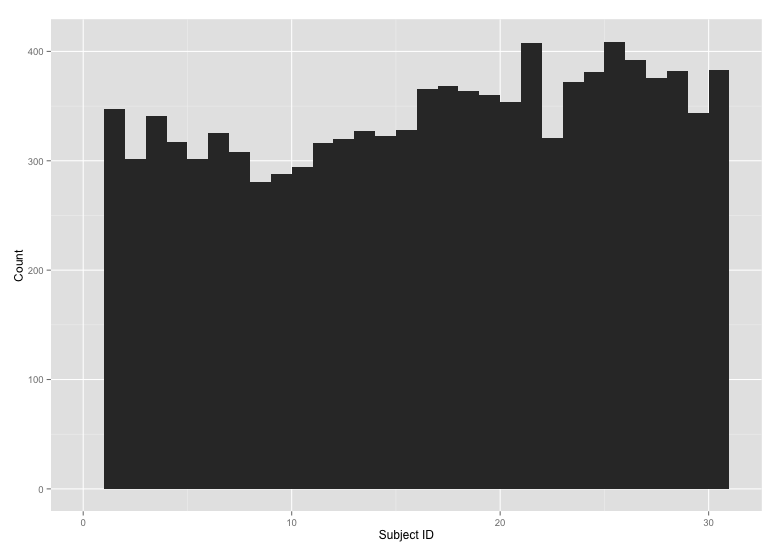

# Code Book
*Assignment Feb 22, 2015*

Contained is a code book for getdata-011 assignment Feb 22, 2015, satisfying
item 3) "a code book that describes the variables, the data, and any
transformations or work that you performed to clean up the data called
CodeBook

## Data

Specifically, you will find output in the form of a 300x8 table with the Subject's ID and Feature measures on the y-axis and each of the activities performed on the x-axis described below. The mean() is taken for each of five variables with both the mean and standard deviation (sigma) measures of each variable. This leads to ten observations for each of 30 subjects, rendering 300 observations each for six activities.

This format was selected for ease of use to anyone looking at the table directly. To import into a tool like Tableau that prefers long-form data, you want to gather up the Subject into a column and Mean in a new column. This simple transform will do that in R with the result in a file named `step5-longer.txt`:

	source("utilities.R")
	ReadStep5() %>%
    	group_by(Subject,Feature) %>%
    	gather(Activity,Mean,-Subject,-Feature) %>%
    	WriteStep5("step5-longer.txt")

## Variables

### Subject

Subject is a factor representing the individuals that took part in the study. The number of samples per subject varies like so:

### Activity

Each activity the subject was performing when the observation was made. This is a factor with the following six possible indices and entries:

* WALKING
* WALKING_UPSTAIRS
* WALKING_DOWNSTAIRS
* SITTING
* STANDING
* LAYING

### Feature

The Features are translations of opaque variable names from the study to human readable forms for the output table. For each of the activities, you will find the following five features, each with two measures for both mean() measures and std() measures for the average and standard deviation respectively.

The five features are body angular velocity and body angular velocity "jerk" magnitude, body linear acceleration and body linear acceleration "jerk" magnitude measures, and gravity linear acceleration gravity magnitude measures.

* BodyAngularVelocityJerkMean
* BodyAngularVelocityJerkSigma
	- The magnitude mean and standard deviation of the body angular velocity "jerk" measurements.

* BodyAngularVelocityMean
* BodyAngularVelocitySigma
	- The magnitude mean and standard deviation of the body angular velocity measurements.

* BodyLinearAccelerationJerkMean
* BodyLinearAccelerationJerkSigma
	- The magnitude mean and standard deviation of body linear acceleration "jerk" measurements.

* BodyLinearAccelerationMean
* BodyLinearAccelerationSigma
	- The magnitude mean and standard deviation of body linear acceleration measurements.

* GravityLinearAccelerationMean
* GravityLinearAccelerationSigma
	- The magnitude mean and standard deviation of the gravitational linear acceleration measurements.

### Mean

The average -- technically the *mean()* of observations with matching Feature and Activity variables.

## Transformations

Following are details on the transformations the data undergoes, erring on the side of more detail...

### getActivities(wd = "UCI_HAR_Dataset")

The Dataset contains a file called `activity_labels.txt`. This file contains the factors against which we bucket our data. Each activity was recorded and stored with each data point, indexed against this file.

    1 WALKING
    2 WALKING_UPSTAIRS
    3 WALKING_DOWNSTAIRS
    4 SITTING
    5 STANDING
    6 LAYING

### getAveragedEach(tab)

1. Clean up the variable names, as there are no longer any duplicate names
1. Group data by the Activity Names and Features (variable names)
1. Summarize data by the mean across Activities and Features

The data is then converted into a data.frame and returned.

### getFeatures(wd = "UCI_HAR_Dataset")

Simply read and return the features (the variable names) of each observation.

### getMeanAndSigma(tab)

Receives a single table with factors in a variable named `Activity` and returns a table of means and standard deviations for all variables, cut into factors as defined by the `Activity` column.

*NOTE: a table built by getReadAndMerged() should work as input*.

A dataset is then built by:

1. Stripping out all columns except for those ending in mean() and std(). 
1. Stripping out the columns summarizing frequency distributions, sticking with the temporal variables.

### getReadAndMerged(wd = "UCI_HAR_Dataset")

getReadAndMerged() receives a single argument `wd` as the working directory in which to find the *UCI HAR Dataset*. The default is `UCI_HAR_Dataset`, the directory created by the data-reset.R script. The function builds a merged table for the UCI_HAR_Dataset, assigning the variables names from the features.txt file, subject identifiers from the subject_test.txt and subject_train.txt files, and activities from the activity_labels.txt file.

First the data is read and descriptive variable names are added by:

1. Prepending a unique index id
1. Assigning the resulting id_name to the appropriate column as identified in features.txt
1. Adding a descriptive activity column by looking up the activity index of each observation in activity_labels.txt as read by `getActivities()`

The train and the test sets are then merged together and returned.

### setTidyNames(tab)

The names of each variable are somewhat opaque, so setTidyNames converts them to something a bit more descriptive on first glance.

1. Convert tBody and tGravity to Body and Gravity
1. Convert GyroJerkMag and GyroMag to the appropriate Angular Velocity and Angular Velocity Jerk names.
1. Convert AccJerkMag and AccMag to the appropriate Linear Acceleration and Linear Acceleration Jerk names.
1. Convert the simple -mean() and -std() variables to Mean and Sigma names.

### ReadStep5(file="step5.txt")

Simple utility to read the table into a data.frame.

### WriteStep5(tab,file="step5.txt")

Simple utility to write our data.frame to a table on disk.

