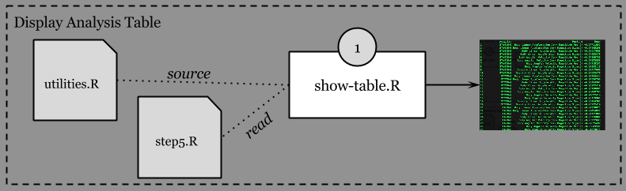

# UCI HAR Dataset Assignment

See also: [CodeBook](https://github.com/jrherrick/gd011proj/blob/master/CodeBook.md) for more information on the data processing and output.

Take a look at [Assignment.md](https://github.com/jrherrick/gd011proj/blob/master/Assignment.md) for information on the assignment details.

## Theory of Operation

To get from an empty working directory to an output file, first clone the git repository with 

    git clone https://github.com/jrherrick/gd011proj.git
    
...then cd into the gd011proj directory that was created. At this point, you'll want to run `data-reset.R`. This will download the data we'll work with and set it up in the directory expected. `run-analysis.R` will then read the data and generate `step5.txt`.

Once `step5.txt` is in place, `show-table.R` will output the data to the screen in a readable fixed-width format. You may redirect this output to a file if needed, but **do not** use this as input to to `show-table.R`.

## Scripts and Utilities

These three utilities and utility library are used to execute the instructions in the assignment. While technically, run-analysis.R will do everything required by the assignment, it leaves a lot of assumptions open. No previous knowledge of the data are assumed here.

### data-reset.R

Assuming nothing about how you have set up your data environment, you will find data-reset.R useful in setting up the dataset as expected by run-analysis.R. Run data-reset.R from your development environment, or on the CLI with Rscript like so, adding a full path to Rscript and data-reset.R if needed:

    Rscript data-reset.R

This script depends on curl being available on your system. The script could probably be smarter about this -- this is left as an exercise for the reader.

### run-analysis.R

Run the script in your IDE, with `./run-analysis.R`, or with an explicit Rscript execution like so:

    Rscript run-analysis.R

You will notice that run-analysis.R is quite sparse, leaving all the work to utility functions in utilities.R. These utilities are broken out into (essentially) the high-level steps from the assignment. 

### show-table.R

Yields a simple, visually aligned, fixed-width summary of the table output by run-analysis.R.

    show-table.R

### utilities.R

*This file is not intended to be run, instead providing the functions needed by the scripts.*

#### getActivities(wd = "UCI_HAR_Dataset")

The Dataset contains a file called `activity_labels.txt`. This file contains the factors against which we bucket our data. Each activity was recorded and stored with each data point, indexed against this file.

    1 WALKING
    2 WALKING_UPSTAIRS
    3 WALKING_DOWNSTAIRS
    4 SITTING
    5 STANDING
    6 LAYING

#### getAveragedEach(tab)

1. Clean up the variable names, as there are no longer any duplicate names
1. Group data by the Activity Names and Features (variable names)
1. Summarize data by the mean across Activities and Features

The data is then converted into a data.frame and returned.

#### getFeatures(wd = "UCI_HAR_Dataset")

Simply read and return the features (the variable names) of each observation.

#### getMeanAndSigma(tab)

Receives a single table with factors in a variable named `Activity` and returns a table of means and standard deviations for all variables, cut into factors as defined by the `Activity` column.

*NOTE: a table built by getReadAndMerged() should work as input*.

A dataset is then built by:

1. Stripping out all columns except for those ending in mean() and std(). 
1. Stripping out the columns summarizing frequency distributions, sticking with the temporal variables.

#### getReadAndMerged(wd = "UCI_HAR_Dataset")

getReadAndMerged() receives a single argument `wd` as the working directory in which to find the *UCI HAR Dataset*. The default is `UCI_HAR_Dataset`, the directory created by the data-reset.R script. The function builds a merged table for the UCI_HAR_Dataset, assigning the variables names from the features.txt file and activities from the activity_labels.txt file.

First the data is read and descriptive variable names are added by:

1. Prepending a unique index id
1. Assigning the resulting id_name to the appropriate column as identified in features.txt
1. Adding a descriptive activity column by looking up the activity index of each observation in activity_labels.txt as read by `getActivities()`

The train and the test sets are then merged together and returned.

#### setTidyNames(tab)

The names of each variable are somewhat opaque, so setTidyNames converts them to something a bit more descriptive on first glance.

1. Convert tBody and tGravity to Body and Gravity
1. Convert GyroJerkMag and GyroMag to the appropriate Angular Velocity and Angular Velocity Jerk names.
1. Convert AccJerkMag and AccMag to the appropriate Linear Acceleration and Linear Acceleration Jerk names.
1. Convert the simple -mean() and -std() variables to Mean and Sigma names.

#### ReadStep5(file="step5.txt")

Simple utility to read the table into a data.frame.

#### WriteStep5(tab,file="step5.txt")

Simple utility to write our data.frame to a table on disk.

