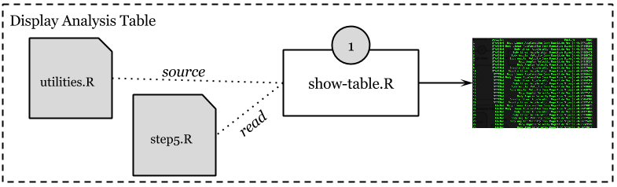

# UCI_HAR_Dataset Assignment

See also: [CodeBook](https://github.com/jrherrick/gd011proj/blob/master/CodeBook.md) for more information on the data. Take a look at [Assignment.md](https://github.com/jrherrick/gd011proj/blob/master/Assignment.md) for information on the assignment proper.

## Theory of Operation

To get from an empty working directory to an output file, first clone the git repository with 

    git clone https://github.com/jrherrick/gd011proj.git
    
...then cd into the gd011proj directory that was created. At this point, you'll want to run `data-reset.R`. This will download the data we'll work with and set it up in the directory expected. `run-analysis.R` will then read the data and generate `step5.txt`.

Once `step5.txt` is in place, `show-table.R` will output the data to the screen in a readable fixed-width format. You may redirect this output to a file if needed, but **do not** use this as input to to `show-table.R`.

## Scripts and Utilities

### data-reset.R

Assuming nothing about how you have set up your data environment, you will find data-reset.R useful in setting up the dataset. Run it from your development environment, or on the CLI with Rscript like so, adding a full path to Rscript and data-reset.R if needed:

    Rscript data-reset.R

This script depends on curl being available on your system. The script could probably be smarter about this -- this is left as an exercise for the reader.

### run-analysis.R

    Rscript run-analysis.R

### show-table.R

    show-table.R

### utilities.R

This file is not intended to be run, instead providing the functions needed by the scripts.

#### getActivities(wd = "UCI_HAR_Dataset")

The Dataset contains a file called `activity_labels.txt`. This file contains the factors against which we bucket our data. Each activity was recorded and stored with each data point, indexed against this file.

    1 WALKING
    2 WALKING_UPSTAIRS
    3 WALKING_DOWNSTAIRS
    4 SITTING
    5 STANDING
    6 LAYING

#### getAveragedEach(tab)

#### getFeatures(wd = "UCI_HAR_Dataset")

#### getMeanAndSigma(tab)

Receives a single table with factors in a variable named `Activity` and returns a table of means and standard deviations for all variables, cut into factors as defined by the `Activity` column.

*NOTE: a table built by getReadAndMerged() should work as input*.

#### getReadAndMerged(wd = "UCI_HAR_Dataset")

getReadAndMerged() receives a single argument `wd` as the working directory in which to find the *UCI HAR Dataset*. The default is `UCI_HAR_Dataset`, the directory created by the data-reset.R script. The function builds a merged table for the UCI_HAR_Dataset, assigning the variables names from the features.txt file and activities from the activity_labels.txt file. The activities are read from the YTest and YTrain.

#### setTidyNames(tab)

#### ReadStep5(file="step5.txt")

#### WriteStep5(tab,file="step5.txt")

